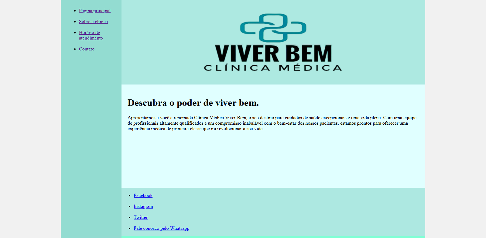
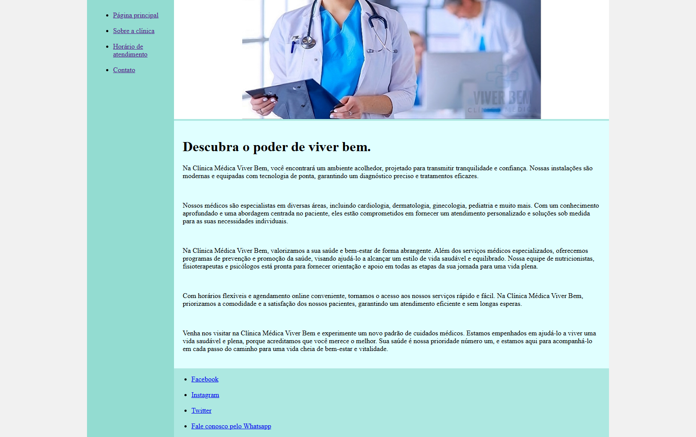
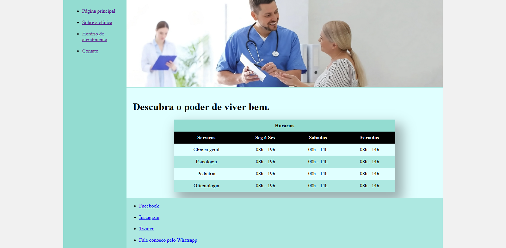
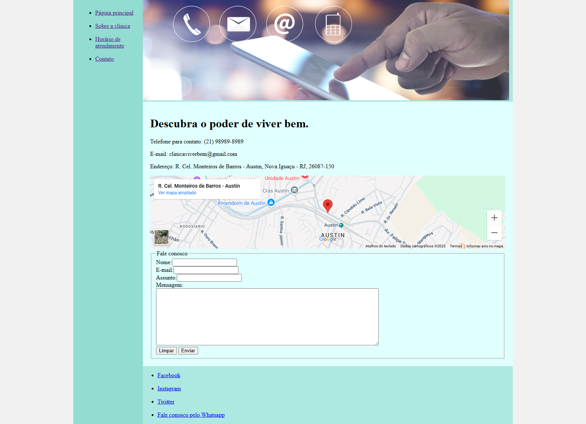

# 🏥 Clínica Médica Viver Bem - Projeto HTML

Este projeto foi desenvolvido como parte do segundo desafio da formação HTML da plataforma [Dio.me](https://dio.me). O objetivo era criar um site multipágina usando HTML puro, simulando a estrutura de uma clínica médica fictícia.

## 📝 Sobre o Projeto

O site é composto por 4 páginas interligadas, representando seções clássicas de um site institucional:

- **Página Principal**
- **Sobre a Clínica**
- **Horário de Atendimento**
- **Contato**

Além da navegação entre páginas, o site inclui uma tabela com horários, um formulário de contato funcional (estático), um mapa do Google e estrutura visual com apoio de CSS.

> ⚠️ **O arquivo CSS foi fornecido pelo instrutor.** A estrutura e todo o conteúdo HTML foram escritos por mim.

## 🔧 Tecnologias Utilizadas

- HTML5
- CSS3 (estático, fornecido)

## 💡 O que aprendi

Neste projeto, pratiquei os seguintes conceitos fundamentais de HTML:

- Criação de sites com múltiplas páginas HTML
- Estruturação de navegação com `<a href="">`
- Uso de listas, tabelas, formulários e `<iframe>`
- Inserção e organização de imagens
- Boas práticas com nomes de arquivos e organização de diretórios

## 📸 Prévia

### Página Principal

### Sobre a Clínica

### Horário de Atendimento

### Contato

## 🔗 Acesse o projeto

Você pode visualizar este projeto publicado no GitHub Pages:

➡️ [Clique aqui para acessar](https://luis-fellipe.github.io/clinica-medica-viver-bem/)

📌 **Nota:** Este projeto foi feito com foco em HTML. O CSS é fixo e não há JavaScript.

## 🧠 Autor

**Luís Fellipe**  
📎 [Meu LinkedIn](https://www.linkedin.com/in/luis-fellipe-real)
